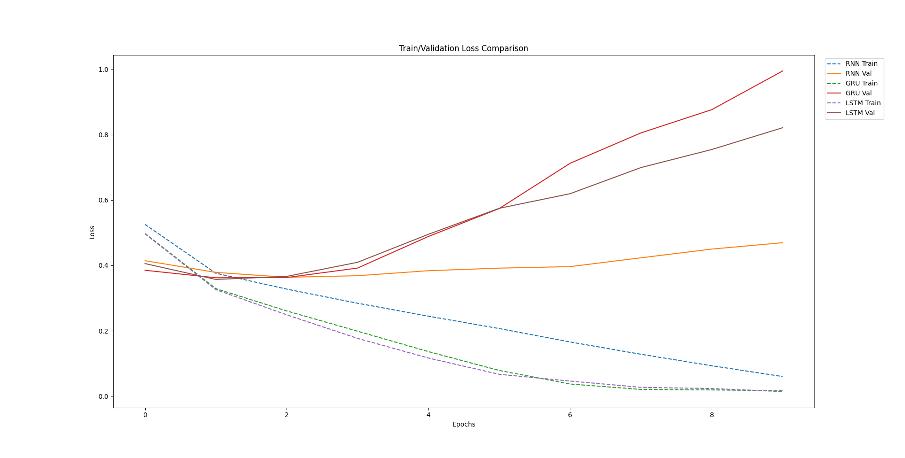

Overview
========

This repository compares various models for IMDB sentiment analysis, including three types of recurrent neural networks—**RNN**, **GRU**, and **LSTM**—along with two baseline models: **Naive Bayes** and **Logistic Regression**. The project demonstrates model performance on a text classification task using the IMDB movie reviews dataset, showing training/validation loss curves and final evaluation metrics.

A plot (RNN\_Curves.png) visualizes the training and validation loss progression for the neural network models, while the notebooks provide hands-on implementations of each approach.

Table of Contents
=================

1.  [Project Structure](#project-structure)
    
2.  [Dependencies](#dependencies)
    
3.  [Usage](#usage)
    
4.  [Model Implementations](#model-implementations)
    
    *   [Recurrent Neural Networks](#recurrent-neural-networks)
        
    *   [Naive Bayes](#naive-bayes)
        
    *   [Logistic Regression](#logistic-regression)
        
5.  [Results](#results)
    

Project Structure
-----------------

*   **RNN.ipynb**: Notebook containing the code for training and evaluating the RNN model.
    
*   **logistic\_regression.ipynb**: Notebook demonstrating a Logistic Regression approach for sentiment analysis.
    
*   **Naive\_Bayes.ipynb**: Notebook demonstrating a Naive Bayes approach for sentiment analysis.
    
*   **RNN\_Curves.png**: Plot showing the training and validation loss curves for RNN, GRU, and LSTM models.
    
*   **RNN\_output.txt**: Sample output log displaying training progress and final metrics of the three neural network models.
    

Dependencies
------------

*   Python 3.7+
    
*   PyTorch
    
*   NumPy
    
*   Matplotlib
    
*   Jupyter Notebook (optional, for interactive exploration)
    

Install dependencies using:
```bash
pip install torch numpy matplotlib jupyter
```
Usage
-----
```bash
1.  git clone https://github.com/your-username/your-repo-name.gitcd your-repo-name
```
2.  **Prepare the Dataset**
    
    *   Download the IMDB dataset (e.g., from [here](https://ai.stanford.edu/~amaas/data/sentiment/)).
        
    *   Update dataset paths in the code if necessary.
        
3.  **Run the Notebooks or Scripts**
    
    *   Run the Python scripts directly (e.g., python RNN.py).
        
4.  **View the Results**
    
    *   Monitor training and validation loss during execution.
        
    *   Final evaluation metrics (accuracy, precision, recall, F1-score) are printed upon completion.
        

Model Implementations
---------------------

### Recurrent Neural Networks

*   **RNN/GRU/LSTM**:These models process sequential text data using different recurrent architectures.
    
    *   **RNN**: A basic recurrent network that processes inputs sequentially.
        
    *   **GRU**: Uses gating mechanisms to better capture long-term dependencies.
        
    *   **LSTM**: Incorporates forget, input, and output gates to manage information flow more effectively.
        

### Naive Bayes

*   **Naive Bayes**:A probabilistic classifier based on Bayes’ theorem with the assumption of feature independence.It is fast to train and particularly effective for text classification, making it a useful baseline for comparing more complex models.
    

### Logistic Regression

*   **Logistic Regression**:A linear classification method that uses the logistic function to model binary outcomes.It provides a straightforward approach to estimating the probability of a review being positive or negative, serving as another quick baseline for sentiment analysis.
    

Results
-------

Final metrics on the test set for the neural network models:

| Model  | Accuracy | Precision | Recall  | F1-score |
|--------|----------|-----------|---------|----------|
| **RNN**  | 0.8348   | 0.8357    | 0.8335  | 0.8346   |
| **GRU**  | 0.8421   | 0.8493    | 0.8317  | 0.8404   |
| **LSTM** | 0.8394   | 0.8201    | 0.8696  | 0.8441   |

The loss curves for the neural network models are displayed in the figure below:




For more details, you are asked to read the AI Report here 
========


